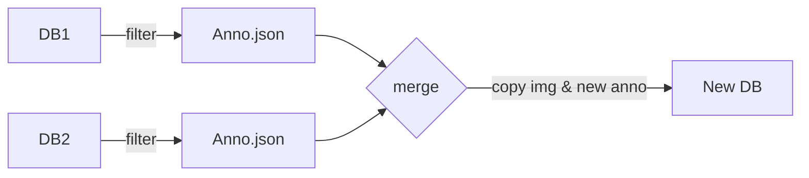

# MV_PSR_DB_manager

* MOVON PSR(Passenger State Recognition) Database manager Code & Script git
    - Repacking the several dataset dirs into a single coco-formatting dataset

## HOW TO USE
* run manifest.py in each dataset dir -> made dataset_info.meta
* run manager.py with target dataset dirs

## Process Flow

## Reference
* cocoapi: [https://github.com/cocodataset/cocoapi](https://github.com/cocodataset/cocoapi)
